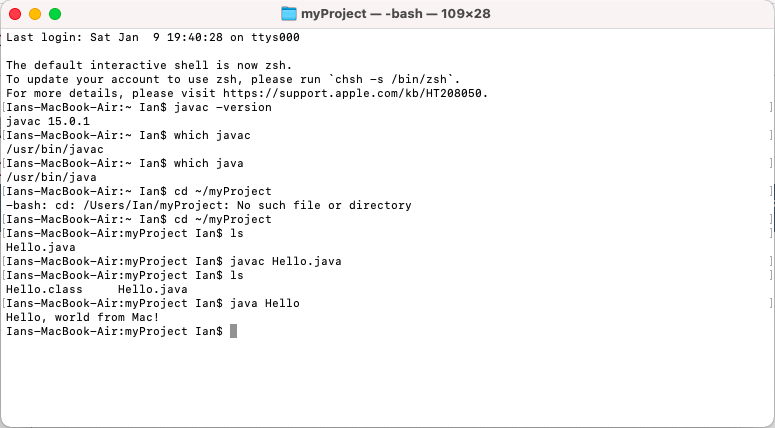
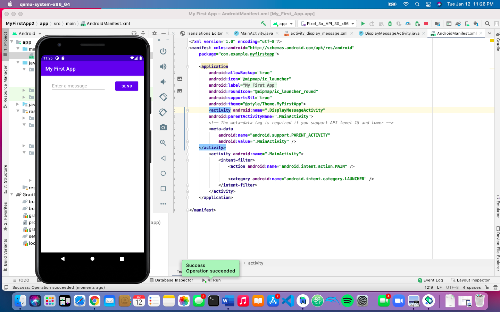

images> **NOTE:** This README.md file should be placed at the **root of each of your repos directories.**
>
>Also, this file **must** use Markdown syntax, and provide project documentation as per below--otherwise, points **will** be deducted.
>

# LIS4331 - Advanced Mobile Applications Development

## Ian Stephenson - 

### Assignment 1 Requirements:

*Four Parts:*

1. Distributed Version Control with Git and Bitbucket
2. Developmet Installations
3. Chapter Questions (Chs 1,2)
4. Bitbucket repo links: a) this assignment and b) the completed tutorials above(bitbucketstationlocations and myteamquotes)

#### README.md file should include the following items:

* Screenshot of running java Hello
* Screenshot of running Android Studio - My first App
* Screenshot of running Android Studio - Contacts App
* git commands w/short descriptions 

> This is a blockquote.
> 
> This is the second paragraph in the blockquote.
>
> #### Git commands w/short descriptions:

1. git-init - Create an empty Git repository or reinitialize an existing one
2. git-status - Show the working tree status
3. git-add - Add file contents to the index
4. git-commit - Record changes to the repository
5. git-push - Update remote refs along with associated objects
6. git-pull - Fetch from and integrate with another repository or a local branch
7. git-clean - Remove untracked files from the working tree

#### Assignment Screenshots:

*Screenshot of running java Hello*:

*Screenshot of Android Studio - My first App*:

*Screenshot of Contacts App - Main Screen*:

#### Tutorial Links:

*Bitbucket Tutorial - Station Locations:*
[A1 Bitbucket Station Locations Tutorial Link](https://bitbucket.org/ids17/bitbucketstationlocations/ "Bitbucket Station Locations")
