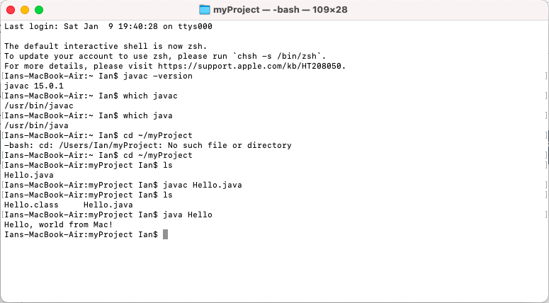

> **NOTE:** This README.md file should be placed at the **root of each of your repos directories.**
>
>Also, this file **must** use Markdown syntax, and provide project documentation as per below--otherwise, points **will** be deducted.
>

# LIS4331 - Advanced Mobile Applications Development

## Ian Stephenson

### Assignment 2 Requirements:

#### Assignment Screenshots:

*Screenshot of Unpopulated user interface*:

*Screenshot of Populated user interface*:

