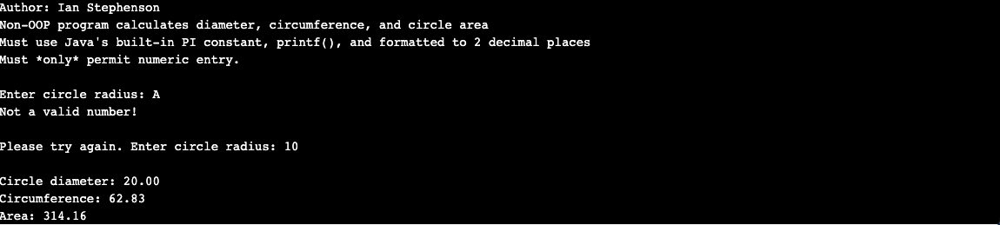
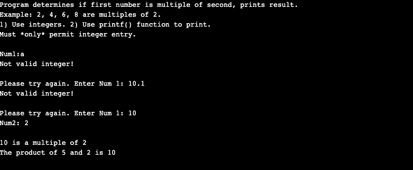
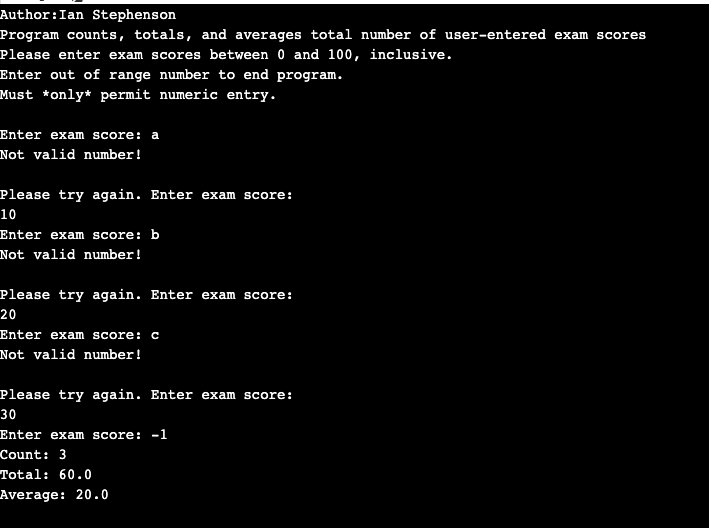

> **NOTE:** This README.md file should be placed at the **root of each of your repos directories.**
>
>Also, this file **must** use Markdown syntax, and provide project documentation as per below--otherwise, points **will** be deducted.
>

# LIS4331 - Advanced Mobile Applications Development

## Ian Stephenson

### Assignment 2 Requirements:

*Research how to complete the following requirements(see screenshots below):*

1. Drop-down menu for total number of guests (including yourself): 1 –10
2. Drop-down menu for tip percentage (5% increments): 0 –25
3. Must add background color(s) or theme(10 pts)
4. Must add background color(s) or theme(10 pts)
5. Must create and displaylauncher icon image(10 pts)

#### README.md file should include the following items:

1. Course title, your name, assignment requirements, as per A1;
2. Screenshot of running application’s unpopulated user interface;
3. Screenshot of running application’s populated user interface;

#### Assignment Screenshots:

*Screenshot of running application's unpopulated user interface *:

 

*Screenshot of running application's populated user interface *:

*Screenshot of SS1 - Java: Non-OOP Circle *:

*Screenshot of SS2 - Java: Multiple Number*:

*Screenshot of SS3 - Java: Nested Structures 2 *:

