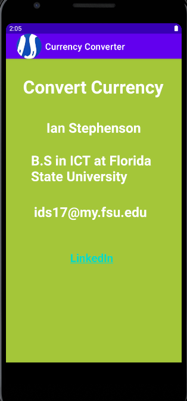
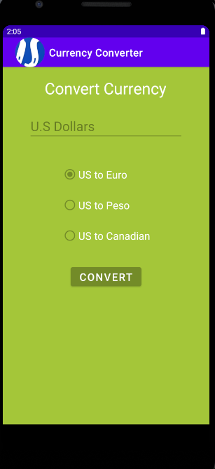
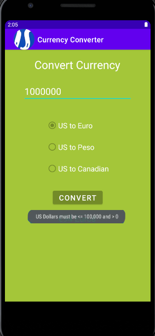
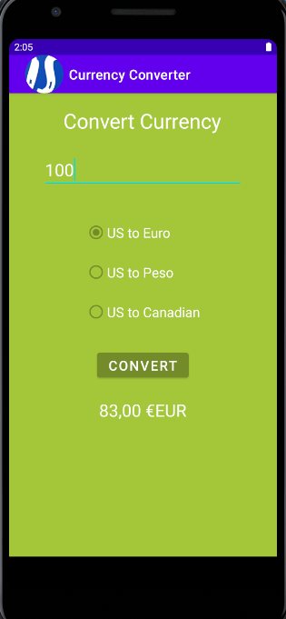

> **NOTE:** This README.md file should be placed at the **root of each of your repos directories.**
>
>Also, this file **must** use Markdown syntax, and provide project documentation as per below--otherwise, points **will** be deducted.
>

# LIS4331 - Advanced Mobile Applications Development

## Ian Stephenson

### Assignment 3 Requirements:

*Research how to complete the following requirements(see screenshots below):*

1. Field to enter U.S. dollar amount: 1 – 100,000
2. Must include toast notification if user enters out-of-range values
3. Radio buttons to convert from U.S. to Euros, Pesos and Canadian currency (must be vertically and horizontally aligned)
4. Must include correct sign for euros, pesos, and Canadian dollars
5. Must add background color(s) or theme
6. Create and display launcher icon image
7. Create Splash/Loading Screen:
    + a. Purpose: *not* to waste a user’s time, but rather give them something informative and
    visually appealing while they wait for an app to load. Examples of judicial/appropriate usage
    would be when an app is resource intensive--that is, when pulling in data, making network
    calls, or other time-consuming events.
    + b. How: Research why--and how to create--Android splash/loading screens. Moreover, instead
    of just using a static image, employ some type of *animated* splash screen or other device
    that either is informative or promotes you, your company, and will maintain the user's
    attention--note: no more than 3 seconds.    

#### README.md file should include the following items:

1. Course title, your name, assignment requirements, as per A1;
2. Screenshot of running application’s unpopulated user interface;
3. Screenshot of running application’s toast notification;
4. Screenshot of running application's converted currency user interface;

#### Assignment Screenshots:

*Screenshot of running applications's splash screeen *:

*Screenshot of running application's unpopulated user interface *:

 

*Screenshot of running application's toast notification *:

*Screenshot of converted currency user interface *:

*Screenshot of SS4 - Java: Time Conversion *:

*Screenshot of SS5 - Java: Even/Odd (GUI) *:

*Screenshot of SS6 - Java: Paint Calculator (GUI) *:

