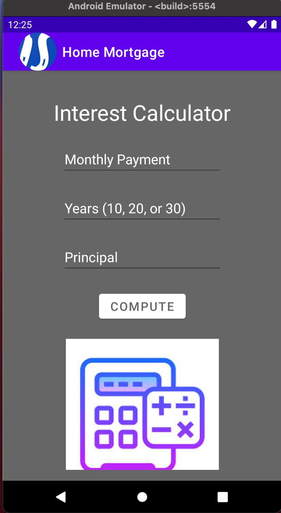

> **NOTE:** This README.md file should be placed at the **root of each of your repos directories.**
>
>Also, this file **must** use Markdown syntax, and provide project documentation as per below--otherwise, points **will** be deducted.
>

# LIS4331 - Advanced Mobile Applications Development

## Ian Stephenson

### Assignment 4 Requirements:

*Research how to completethe following requirements(see screenshots below):*

1. Include splash screen image(or, create your own), app title, intro text.
2. Include appropriate images.
3. Must use persistent data: SharedPreferences
4. Widgets and images must be vertically and horizontally aligned.
5. Must add background color(s) or theme
6. Create and displaylauncher icon image

#### README.md file should include the following items:

1. Course title, your name, assignment requirements, as per A1;
2. Screenshot of running application’s splash screen;
3. Screenshot of running application’s invalid screen (with appropriate image);
4. Screenshots of running application’s valid screen (with appropriate image);

#### Assignment Screenshots:

|*Splash Screen*:                                   |*Main*:                                            |
|---------------------------------------------------|---------------------------------------------------|
||    |

|*Incorrect number of years*:                       |*Valid Entry *:                                    |
| |                      ||                                                   |                                                   | |*SS10 - Java: Travel Time*:                        | *SS11 - Java: Product Class*:                     |
|                 |                 |
|*SS12 - Java: Book Inherits Product Class*:        |                                                   |
|                 |                                                   |