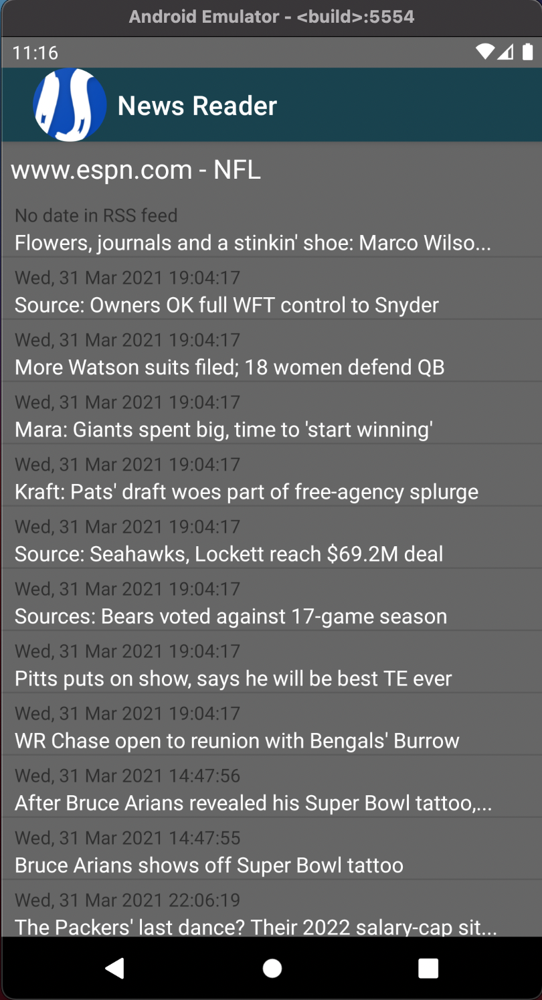
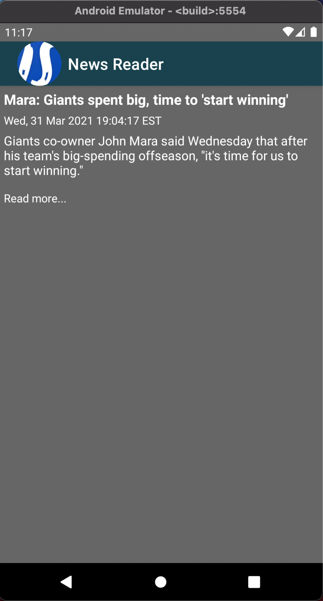
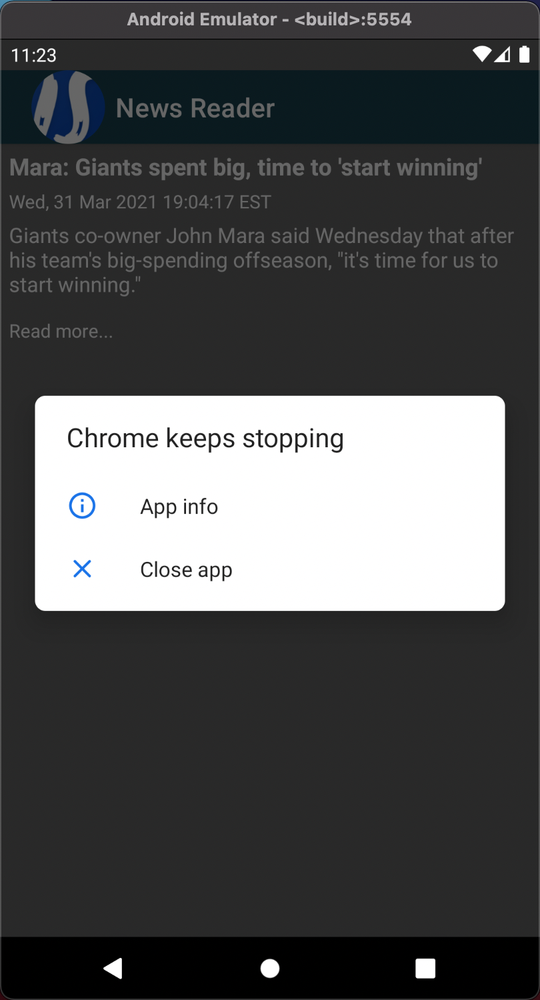
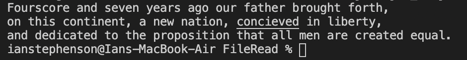
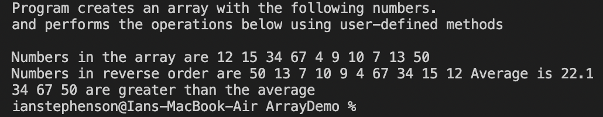

>> **NOTE:** This README.md file should be placed at the **root of each of your repos directories.**
>
>Also, this file **must** use Markdown syntax, and provide project documentation as per below--otherwise, points **will** be deducted.
>

# LIS4331 - Advanced Mobile Applications Development

## Ian Stephenson

### Assignment 5 Requirements:

*Research how to completethe following requirements(see screenshots below):*

1. Include splash screen (optional)
2. Main screen with app title and list of articles.
3. Must find and use your own RSS feed.
5. Must add background color(s) or theme
6. Create and display launcher icon image

#### README.md file should include the following items:

1. Course title, your name, assignment requirements, as per A1;
2. Screenshot of running application’s splash screen;
3. Screenshot of running application’s invalid screen (with appropriate image);
4. Screenshots of running application’s valid screen (with appropriate image);

#### Assignment Screenshots:

|*Items Activity*                                   |*Item Activity*                                    |
|:-------------------------------------------------:|:-------------------------------------------------:|
| |    |

| *Read More(Chrome Error)*                         | *SS13 - Java: Write/Read File*                    |
|:-------------------------------------------------:|:-------------------------------------------------:|
|      |    |

|*SS14 - Java: Simple Interest Calculator*|*SS15 - Java: Array Demo           |
|images/ss14.png)|      
