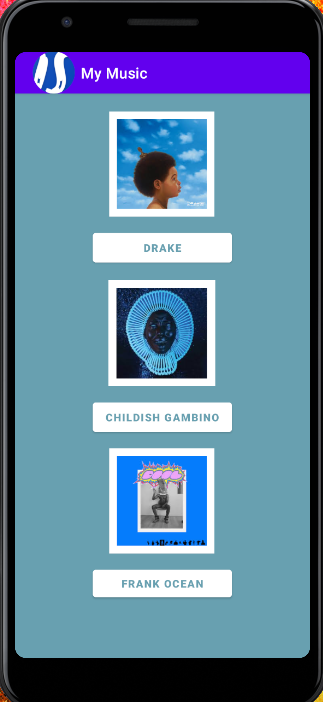
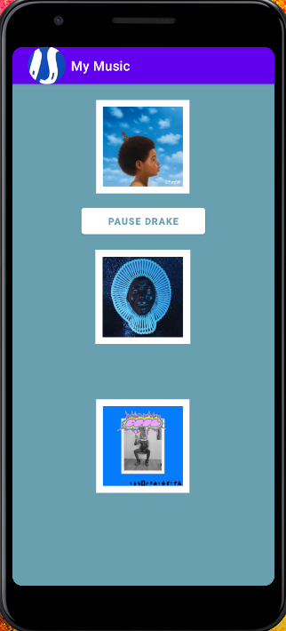
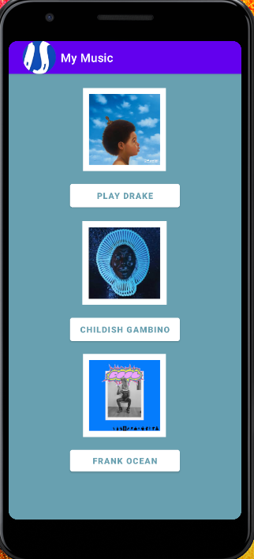

> **NOTE:** This README.md file should be placed at the **root of each of your repos directories.**
>
>Also, this file **must** use Markdown syntax, and provide project documentation as per below--otherwise, points **will** be deducted.
>

# LIS4331 - Advanced Mobile Applications Development

## Ian Stephenson

### Project 1 Requirements:

*Research how to complete the following requirements(see screenshots below):*

1. Include splash screen image, app title, intro text.
2. Include artists’ images and media.
3. Images and buttons must be vertically and horizontally aligned.
4. Must add background color(s) or theme
5. Create and display launcher icon image

#### README.md file should include the following items:

* Course title, your name, assignment requirements, as per A1;
* Screenshot of running application’s splash screen;
* Screenshot of running application’s follow-up screen (with images and buttons);
* Screenshots of running application’s play and pause user interfaces (with images and buttons);

#### Assignment Screenshots:

*Screenshot of running application's splash screen*:

*Screenshot of running application's follow up screen (with images and buttons)*:

*Screenshot of running application's play user interface (with images and buttons)*:

*Screenshot of running application's pause user interface (with images and buttons)*:

*Screenshot of SS7 - Java: Measurement Conversion) *:

*Screenshot of SS8 - Java: Distance Calculator (GUI) *:

