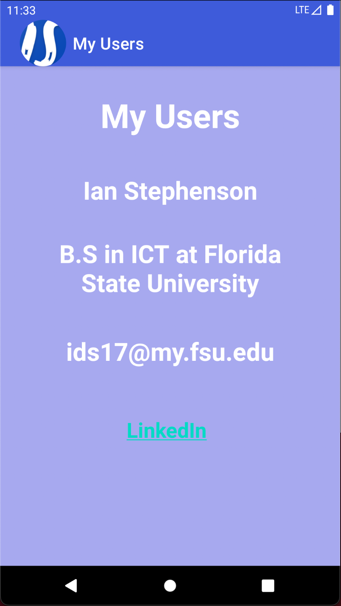
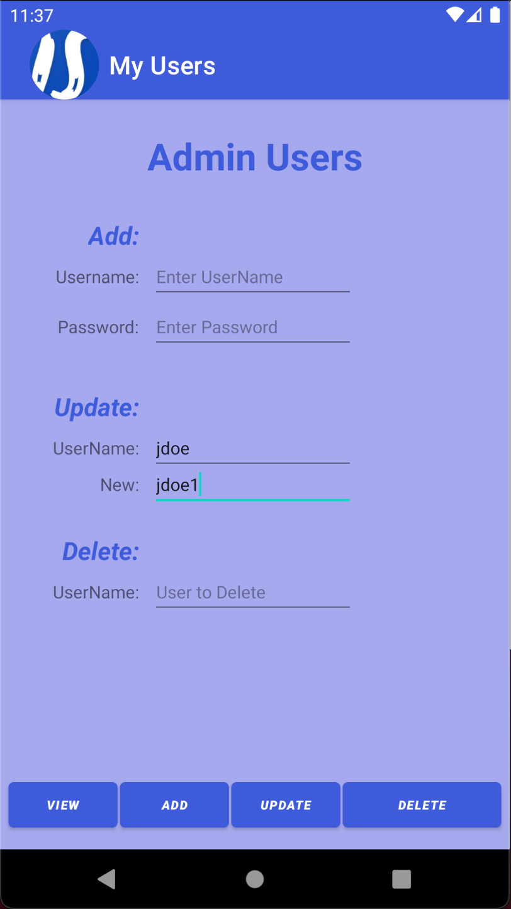
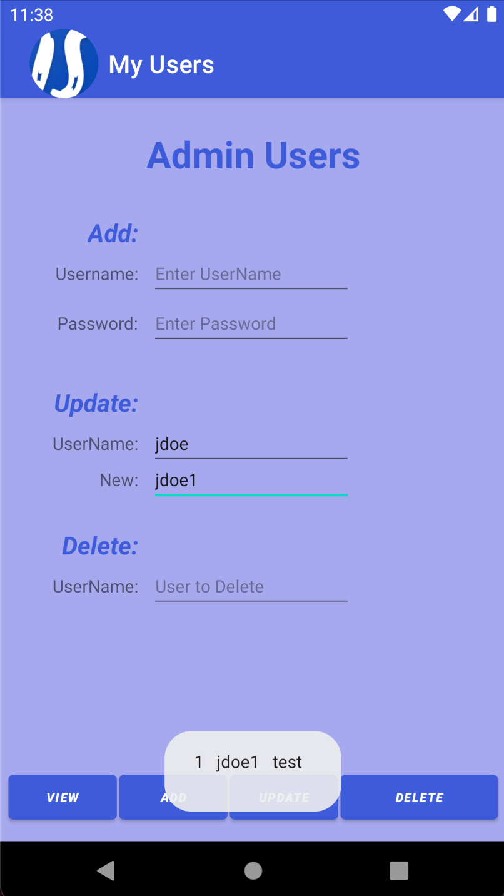
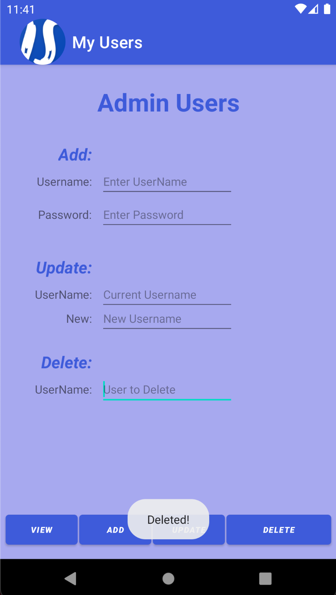

> **NOTE:** This README.md file should be placed at the **root of each of your repos directories.**
>
>Also, this file **must** use Markdown syntax, and provide project documentation as per below--otherwise, points **will** be deducted.
>

# LIS4331 - Advanced Mobile Applications Development

## Ian Stephenson

### Project 1 Requirements:

*Research how to complete the following requirements(see screenshots below):*

1. Include splash screen image, app title, intro text.
2. Include artists’ images and media.
3. Images and buttons must be vertically and horizontally aligned.
4. Must add background color(s) or theme
5. Create and display launcher icon image

#### README.md file should include the following items:

* Course title, your name, assignment requirements, as per A1;
* At least five screenshots of running application, as per below.

#### Assignment Screenshots:

*Splash Screen*:

*Add User*:

*Update User*:

*View User*:

*Delete User*:

